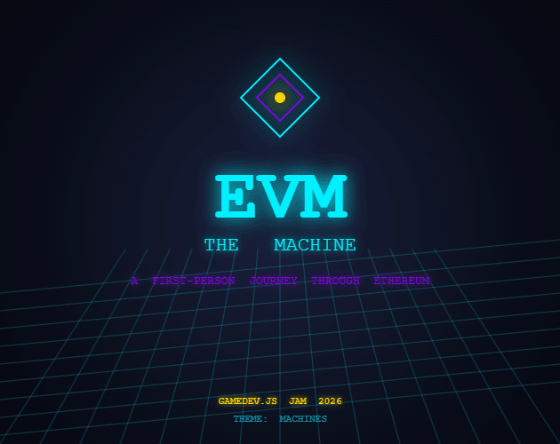

# EVM: The Machine



> **Step inside the World Computer.**
> Eight chapters. Eight moments of Ethereum history. The machine remembers everything you did.

A first-person 3D narrative game built solo in 48 hours for **Gamedev.js Jam 2026** (theme: *Machines*). You walk through eight diegetic scenes from a decade of Ethereum — a Hong Kong dorm room in 2013, an attic full of butcher-paper equations, the Zug spaceship-house, a 42-day crowdsale, a reentrant hall of mirrors, a corridor that forks, a neon DeFi trading floor, and a humming PoW server room on Merge night. In each one you make a small first-person decision. The machine silently records what kind of person each decision implies, and at the end it shows you a mirror — your archetype.

Optional on-chain: every chamber you complete emits a `ChamberCompleted` event on Sepolia. Finish all eight and a `mintJourney` souvenir NFT becomes available. **The chain is the souvenir, not a login gate** — the game is fully playable offline, no wallet required.

---

## 🎮 Play

- **itch.io**: _(submitting before the deadline)_
- **Wavedash**: _(same build, deployed there)_
- **Source on GitHub**: [github.com/k66inthesky/evm-the-machine](https://github.com/k66inthesky/evm-the-machine)

Local development:

```bash
npm install
npm run dev        # localhost:5175
npm run build      # static output in dist/
npm run preview
```

No plugins, no installers — runs in any modern browser.

---

## ⛓ On-chain (Sepolia, optional — but designed for low friction)

- **Contract**: [`EVMHistorian`](contracts/src/EVMHistorian.sol) at [`0x961821ADDf66BBf8A696ced1Ff94d1AD532C6DCB`](https://sepolia.etherscan.io/address/0x961821ADDf66BBf8A696ced1Ff94d1AD532C6DCB) — soulbound ERC-721, artwork is the cover image (`submission/cover.png`) served from this repo's GitHub raw URL.
- Finish all eight chapters, and a `mintJourney(completionSeconds)` Journey NFT opens up at the finale (and on the chamber-select screen).
- **Two wallet paths** at the finale, both gated on the same contract:
  - **`CLAIM WITH GOOGLE`** — Coinbase Smart Wallet spawns an ERC-4337 smart account from a passkey / Google / email login, **no extension and no developer signup or credit card required**. This is the path for web2 players.
  - **`CLAIM WITH METAMASK`** — classic injected EOA flow for players who already have a wallet. EIP-6963 wallet discovery picks the actual MetaMask provider when Binance / OKX / Coinbase Wallet extensions are also installed.
- The Journey NFT is **soulbound**: `transferFrom` and `safeTransferFrom` revert. The token id, the bearer, the completion time, and a `tokenURI` (data: URI with embedded JSON + a stable image URL) are all on-chain.

See [`contracts/README.md`](contracts/README.md) for deploy + verify steps.

---

## 🕹 Controls

| Action          | Key                              |
| --------------- | -------------------------------- |
| Move            | `W` `A` `S` `D`                  |
| Look            | Mouse (pointer-lock on click)    |
| Interact        | `E`                              |
| Sprint          | `Shift` (hold)                   |
| Choose          | `1` `2` `3` `4`                  |
| Quit to menu    | `Esc` or `Q` (or click QUIT)     |

Volume and fullscreen toggles live in the top-left of every screen.

---

## 🗺 The eight chapters

Each chapter is a first-person scene, ~60–120 seconds. You walk in, look around, interact with one focal object, and pick from up to four choices. Every choice silently feeds an 8-dimensional archetype tracker. After Chapter 08 the finale screen tells you who the machine thinks you are.

1. **THE LIMIT** *(2013, dorm room)* — Bitcoin Talk thread on the CRT: "Bitcoin is limited to payments — or is it?" Type a reply.
2. **WHITEPAPER** *(2013, Toronto attic)* — Pick the opening sentence of the Ethereum whitepaper from four candidate paragraphs.
3. **SPACESHIP** *(2014, Zug)* — `roles.md` is open on the kitchen table. Pick which of the five hats you take on.
4. **CROWDSALE** *(2014, server room)* — Day 37 of 42. The blog post tomorrow morning will tell 5,000 buyers what ether *is*. Pick the framing.
5. **THE DAO** *(2016, hall of mirrors)* — Seven panels replaying `withdraw()` re-entering itself. Read it. Tell the podium what it means.
6. **FORK** *(2016, block 1,920,000)* — A corridor splits. Hard fork (cyan) or Classic (orange). Or abstain. Or walk out.
7. **BLOOM** *(2020–2021, neon trading floor)* — Four glowing plinths: Money Lego, Primitive, Experiment, Mania. Mint to the one you actually believe in.
8. **MERGE** *(15 Sep 2022, 06:42:42 UTC)* — The last PoW server room. A red button on a pedestal. Press it, pay respects to the miners, study the call stack, or walk out without pressing.

The 8-dim archetype vector — Visionary / Engineer / Capitalist / Governor / Rebel / Speculator / Builder / Witness — never appears in the UI during play. The finale reveals your top two.

---

## 🧱 Tech stack

| Layer              | Choice                                   | Why                                                                       |
| ------------------ | ---------------------------------------- | ------------------------------------------------------------------------- |
| Engine             | [Three.js](https://threejs.org)          | Procedural geometry + canvas-textured diegetic UI is its native idiom     |
| Bundler            | [Vite](https://vitejs.dev)               | Static `dist/` drops straight into itch.io / Wavedash                     |
| Language           | TypeScript                               | Judges can navigate the 8-chamber architecture with type hints            |
| Wallet / RPC       | [viem](https://viem.sh)                  | 10× smaller than ethers+wagmi, clean vanilla integration                  |
| Contracts          | [Foundry](https://getfoundry.sh)         | Single Solidity file, single `forge create` to ship                       |
| Audio              | [Tone.js](https://tonejs.github.io)      | Code-synthesized synthwave loops — no audio assets to manage              |

**Everything in-game is procedurally generated.** No imported 3D models, no texture files, no pre-recorded audio. Every cube, every line of equation on a whiteboard, every snare hit is made from code at runtime.

---

## 🏆 How each jam criterion is addressed

### Overall scoring
- **Innovation** — eight first-person scenes that turn protocol history into *places* you walk through. Every diegetic surface (CRT, laptop, whiteboard, marquee, mirror, plinth, miner face) is a procedurally drawn canvas, not a sprite.
- **Theme (Machines)** — Ethereum is the World Computer. The game is a first-person tour of its memory. The theme isn't decoration — it's the entire premise.
- **Gameplay** — eight chapters, each a single tight decision in a distinct space. No filler. The hidden archetype tracker turns the whole arc into a personality reveal.
- **Graphics** — procedural geometry + canvas textures + selective bloom + fog. Mipmaps + anisotropy on every diegetic screen so text reads at distance. 60fps on a mid-range laptop.
- **Audio** — eight chamber-specific BGM moods composed live in Tone.js plus SFX on every meaningful interaction. Volume + mute in the top-left.

### Challenges
- **Open Source (GitHub)** — every file begins with a header comment explaining its purpose. The folder structure reads top-down: `src/main.ts` → `src/core/game.ts` → `src/chambers/NN-*.ts`. A stranger can understand the architecture in ten minutes.
- **Ethereum (OP Guild)** — the on-chain integration is *meaningful*, not a login wall. Every chamber emits `ChamberCompleted(player, index, at)`. Completing all eight unlocks `mintJourney(completionSeconds)`. Players who never connect a wallet still play the full game; players who do get a permanent on-chain record. See [`EVMHistorian.sol`](contracts/src/EVMHistorian.sol).
- **Wavedash** — the production build deploys unchanged; no platform-specific code.

---

## 🎓 Reading the code

Architecture, top-down:

```
src/
  main.ts                # boots Game
  core/
    game.ts              # state machine: title → select → chamber → finale
    renderer.ts          # WebGL renderer + selective bloom
    fps-controller.ts    # WASD + mouse-look + AABB collision
    input.ts             # key/mouse tracking with per-frame edges + pointer-lock edge
    hud.ts               # DOM overlay for titles, prompts, briefings
    palette.ts           # locked color constants
    progress.ts          # localStorage: chapters completed
    settings.ts          # floating volume + fullscreen
  screens/               # title, chamber-select, finale (archetype mirror), credits
  chambers/
    chamber.ts           # base class — mount / build / update / win / dispose,
                         # plus installBriefing() helper for the four-key
                         # interaction pattern
    01-limit.ts          # 2013 dorm — CRT + phone + bed
    02-whitepaper.ts     # 2013 attic — laptop + two equation whiteboards
    03-spaceship.ts      # 2014 Zug — kitchen table + roles.md
    04-crowdsale.ts      # 2014 server room — LED marquee + draft.txt
    05-thedao.ts         # 2016 — seven mirrors animating reentrancy
    06-fork.ts           # 2016 — corridor fork + miner-vote sign
    07-bloom.ts          # 2020–21 — four plinths, neon DeFi
    08-merge.ts          # 2022 — pedestal + PoW miner blinkenlights
  systems/
    archetype.ts         # 8-dim hidden tracker (V/E/C/G/R/S/B/W)
  audio/
    audio.ts             # facade used by the rest of the game
    synth.ts             # Tone.js composition per chamber
  chain/
    chain.ts             # viem wrapper: connect, markChamber, mintJourney
    abi.ts               # hand-written ABI, matches EVMHistorian.sol
contracts/
  src/EVMHistorian.sol   # on-chain scoreboard + Journey mint
  foundry.toml           # forge config
  README.md              # deploy steps
```

Each chamber is self-contained. Reading `src/chambers/05-thedao.ts` alone tells you the entire DAO experience.

---

## 📝 Credits

- **Design · code · audio**: [k66](https://github.com/k66inthesky)
- **Built with**: Three.js, Vite, viem, Tone.js, Foundry
- **For**: Gamedev.js Jam 2026 · Theme: *Machines*
- **Challenges entered**: Open Source · Ethereum · Wavedash

## 📄 License

MIT. Fork it, remix it, put it in a chamber of your own.
